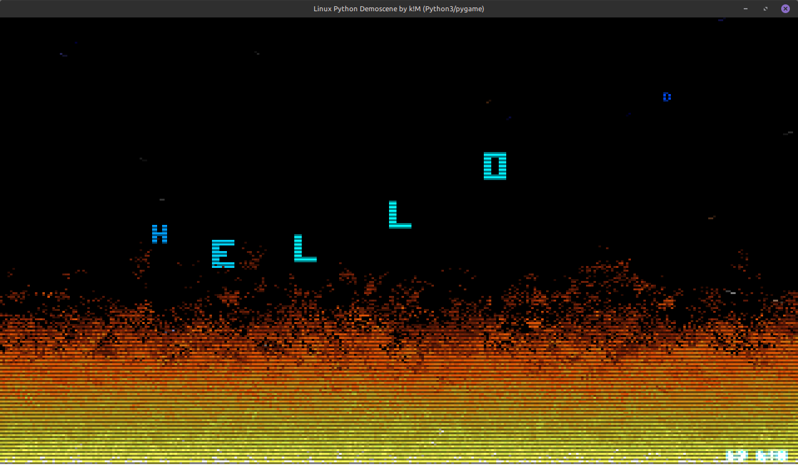

# linuxdemo-python3

A little excercise for myself porting my original demoscene program in C [linuxdemo](https://github.com/pizslacker/linuxdemo), into Python3, showing off classic Amiga demoscene-like graphics, **On Linux**.

Made with `Python3` using `PyGame` that implements the classic "Doom" pixel fire algorithm, spherical text scrolling banner and a parrallax moving star trail background. Now with a soundbyte bgm loop!

Should work on any Linux distribution that has Python3 + PyGame installed.

#### Required:
```bash
sudo apt-get install python3 python3-pygame
```

Usage:
```bash
$ linuxdemo -f / --fullscreen /  -w 1280 -h 720 / --width 1280 --height 720
```

#### What:
- `16KB` optimized demoscene python3 script.
- `44KB` intro sound chunk + `20KB` soundbyte loop (courtesy of [**k!M**](https://soundcloud.com/kim-olsen-357297567)), making the total size `80KB`!

#### How:
- It creates an internal framebuffer (an array of pixels), updates the fire logic by seeding heat at the bottom and spreading it upward with randomized decay, and renders it to an SDL2 texture.
- For the spherical text scroller, it iterates over the string and map each character's index to a circular path using sin(theta) and cos(theta).
- It uses Bresenham's Line Algorithm for parrallax star trails.
- It also emulates CRT scanlines for oldschool feels' :P Right before blasting the buffer to the GPU, we loop over every even row in the frameBuffer and bit-shift/divide the RGB channels by half, creating dark interlaced lines.


